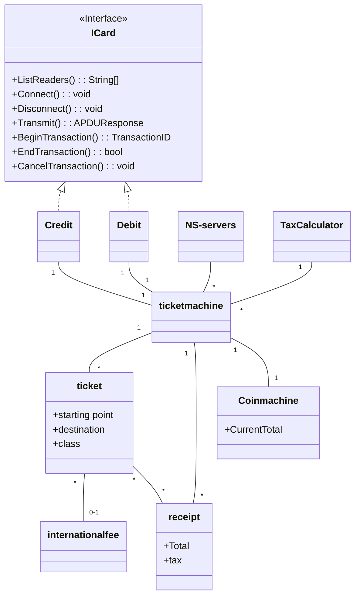

```mermaid
classDiagram

ticket "*" -- "0-1" international fee
ticketmachine "1" -- "*" ticket 
Debit  "1" -- "1" ticketmachine 
Credit "1" -- "1"  ticketmachine 
NS-servers -- "*" ticketmachine 
ticketmachine "1" -- "*" receipt
ticket "*" -- "*" receipt 
ticketmachine "1" -- "1" Coin machine
TaxCalculator "1" -- "*" ticketmachine 

ICard <|.. Credit
ICard <|.. Debit

class ticketmachine

class ticket{
    +starting point
    +destination
    +class
}

class Coinmachine{
    +CurrentTotal
}

class receipt{
    +Total
    +tax
}


class ICard {
    <<Interface>>
 +ListReaders() : String[]
 +Connect(): void
 +Disconnect(): void
 +Transmit() : APDUResponse
 +BeginTransaction(): TransactionID
 +EndTransaction(): bool
 +CancelTransaction() : void
}

class Credit
```