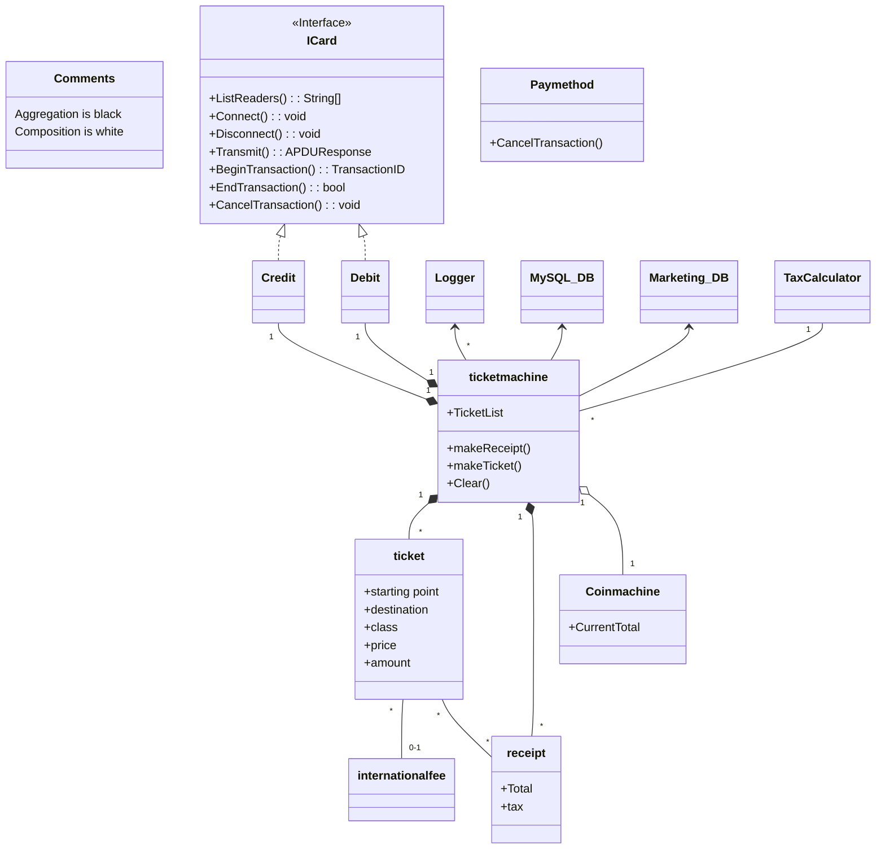

```mermaid
classDiagram

class Comments{
    Aggregation is black
    Composition is white
}

ticket "*" -- "0-1" international fee
ticketmachine "1" *-- "*" ticket
Debit  "1" --* "1" ticketmachine 
Credit "1" --* "1"  ticketmachine 
Logger <-- "*" ticketmachine
MySQL_DB <-- ticketmachine
Marketing_DB <-- ticketmachine
ticketmachine "1" *-- "*" receipt
ticket "*" -- "*" receipt
ticketmachine "1" o-- "1" Coin machine
TaxCalculator "1" -- "*" ticketmachine 

ICard <|.. Credit
ICard <|.. Debit

class ticketmachine{
    +makeReceipt()
    +makeTicket()
    +TicketList
    +Clear()
}

class ticket{
    +starting point
    +destination
    +class
    +price
    +amount
}

class Paymethod{
    +CancelTransaction()
}

class Coinmachine{
    +CurrentTotal
}

class receipt{
    +Total
    +tax
}


class ICard {
    <<Interface>>
 +ListReaders() : String[]
 +Connect(): void
 +Disconnect(): void
 +Transmit() : APDUResponse
 +BeginTransaction(): TransactionID
 +EndTransaction(): bool
 +CancelTransaction() : void
}

class Credit
```