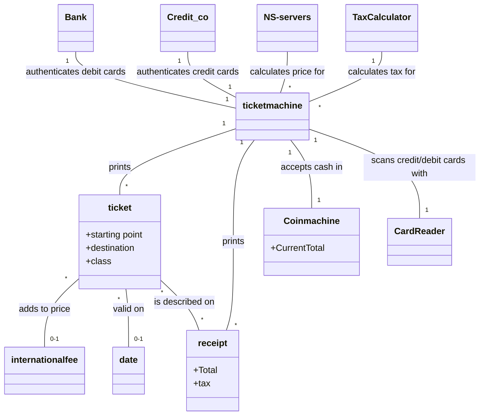

```mermaid
classDiagram

ticket "*" -- "0-1" international fee : adds to price
ticketmachine "1" -- "*" ticket : prints
Bank  "1" -- "1" ticketmachine : authenticates debit cards
Credit_co "1" -- "1"  ticketmachine : authenticates credit cards
ticket "*" -- "0-1" date : valid on
NS-servers -- "*" ticketmachine : calculates price for
ticketmachine "1" -- "*" receipt : prints
ticket "*" -- "*" receipt : is described on
ticketmachine "1" -- "1" Coin machine : accepts cash in
ticketmachine "1" -- "1" CardReader : scans credit/debit cards with
TaxCalculator "1" -- "*" ticketmachine : calculates tax for

class ticketmachine

class ticket{
    +starting point
    +destination
    +class
}

class Coinmachine{
    +CurrentTotal
}

class receipt{
    +Total
    +tax
}
```