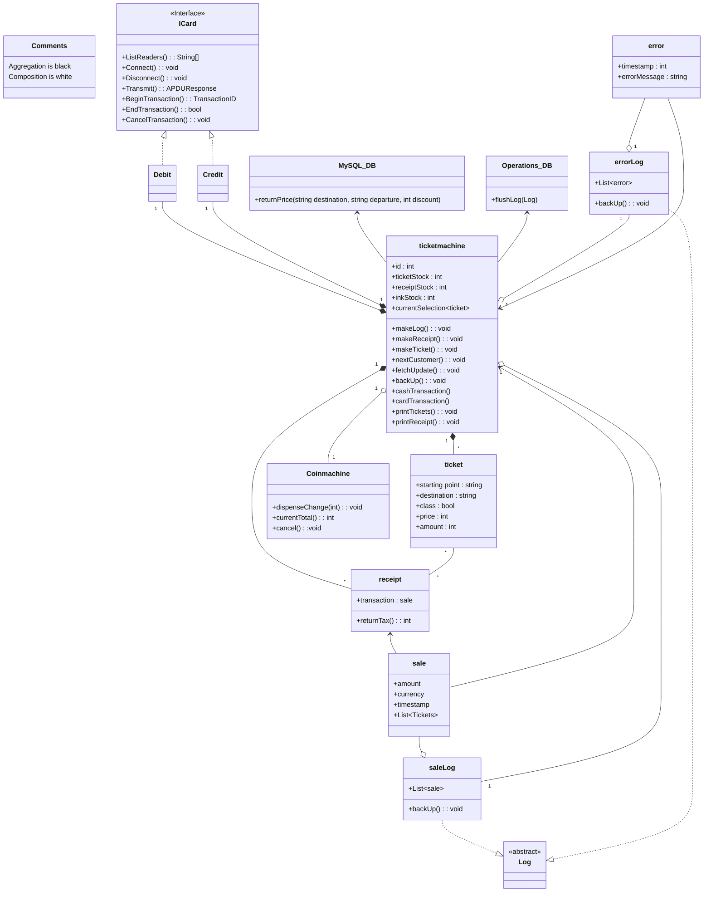

```mermaid
classDiagram

class Comments{
    Aggregation is black
    Composition is white
}


ticketmachine "1" *-- "*" ticket
Debit  "1" --* "1" ticketmachine 
Credit "1" --* "1"  ticketmachine 
MySQL_DB <-- ticketmachine
Operations_DB <-- ticketmachine
ticketmachine "1" *-- "*" receipt
ticket "*" -- "*" receipt
ticketmachine "1" o-- "1" Coin machine

ICard <|.. Credit
ICard <|.. Debit

saleLog "1" --o "1" ticketmachine
errorLog "1" --o "1" ticketmachine
saleLog ..|> Log
errorLog ..|> Log

sale--o saleLog
error --o "1" errorLog
sale --> ticketmachine
error --> ticketmachine

class Operations_DB{
    +flushLog(Log)
}

class MySQL_DB{
    +returnPrice(string destination, string departure, int discount)
}

class sale{
    +amount
    +currency
    +timestamp
    +List~Tickets~
}

class Log{
    <<abstract>>
}

class saleLog{
    +List~sale~
    +backUp () : void
}

class errorLog{
    +List~error~
    +backUp() : void
}

class error{
    +timestamp : int
    +errorMessage : string
}


class ticketmachine{
    +id : int
    +ticketStock : int
    +receiptStock : int
    +inkStock : int 
    +makeLog() : void
    +makeReceipt() : void
    +makeTicket() : void
    +currentSelection~ticket~
    +nextCustomer() : void
    +fetchUpdate() : void
    +backUp() : void
    +cashTransaction()
    +cardTransaction()
    +printTickets(): void
    +printReceipt(): void
}


class ticket{
    +starting point : string
    +destination : string
    +class : bool
    +price : int
    +amount : int
}


class Coinmachine{
    +dispenseChange(int) : void
    +currentTotal() : int
    +cancel():void
}

class receipt{
    +transaction : sale
    +returnTax() : int
}

receipt <-- sale

class ICard {
    <<Interface>>
 +ListReaders() : String[]
 +Connect(): void
 +Disconnect(): void
 +Transmit() : APDUResponse
 +BeginTransaction(): TransactionID
 +EndTransaction(): bool
 +CancelTransaction() : void
}

class Credit
```