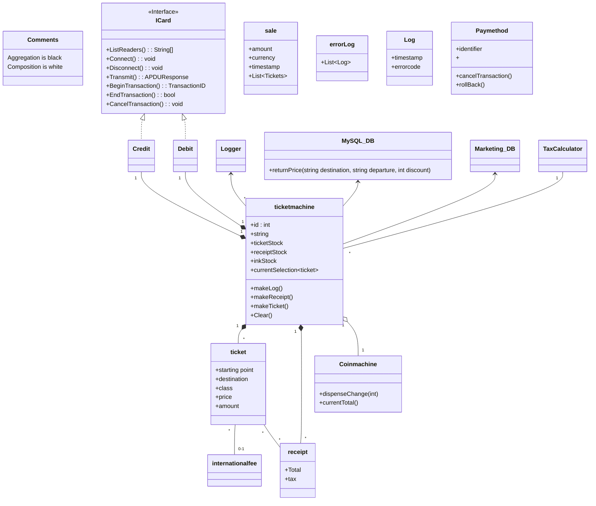

```mermaid
classDiagram

class Comments{
    Aggregation is black
    Composition is white
}

ticket "*" -- "0-1" international fee
ticketmachine "1" *-- "*" ticket
Debit  "1" --* "1" ticketmachine 
Credit "1" --* "1"  ticketmachine 
Logger <-- "*" ticketmachine
MySQL_DB <-- ticketmachine
Marketing_DB <-- ticketmachine
ticketmachine "1" *-- "*" receipt
ticket "*" -- "*" receipt
ticketmachine "1" o-- "1" Coin machine
TaxCalculator "1" -- "*" ticketmachine 

ICard <|.. Credit
ICard <|.. Debit

class MySQL_DB{
    +returnPrice(string destination, string departure, int discount)
}

class sale{
    +amount
    +currency
    +timestamp
    +List~Tickets~
}

class errorLog{
    +List~Log~
}

class Log{
    +timestamp
    +errorcode
}


class ticketmachine{
    +id : int
    +string 
    +ticketStock
    +receiptStock
    +inkStock
    +makeLog()
    +makeReceipt()
    +makeTicket()
    +currentSelection~ticket~
    +Clear()
}


class ticket{
    +starting point
    +destination
    +class
    +price
    +amount
}


class Paymethod{
    +identifier
    +cancelTransaction()
    +rollBack()
    +
}

class Coinmachine{
    +dispenseChange(int)
    +currentTotal()
}

class receipt{
    +Total
    +tax
}


class ICard {
    <<Interface>>
 +ListReaders() : String[]
 +Connect(): void
 +Disconnect(): void
 +Transmit() : APDUResponse
 +BeginTransaction(): TransactionID
 +EndTransaction(): bool
 +CancelTransaction() : void
}

class Credit
```